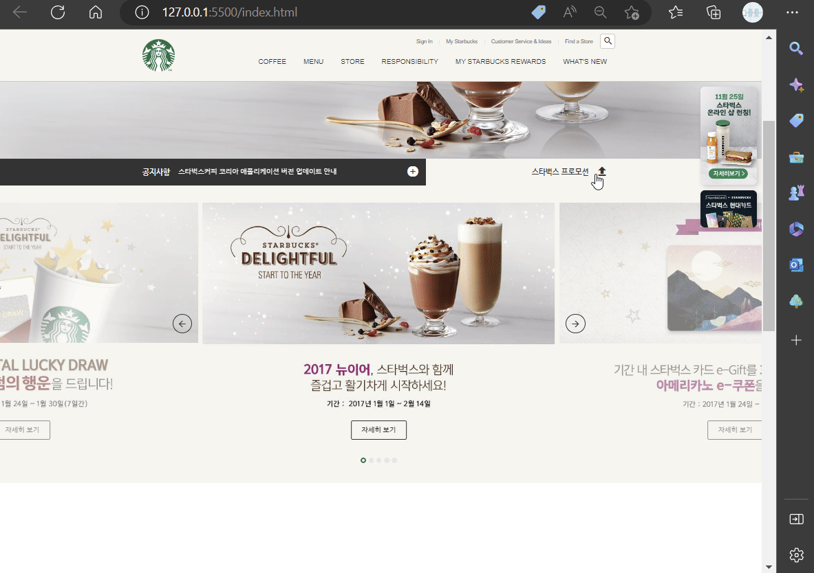
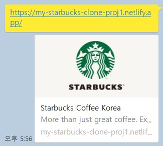

[](https://app.netlify.com/sites/my-starbucks-clone-proj1/deploys)

# ☕ STARBUCKS Main page Clone Project

<div align="center">

</div>

---

# :bell: Visit the site

➡️ [<u>Go to Site</u>](https://my-starbucks-clone-proj1.netlify.app/ "Open page")

## 🧐 About

Starbucks homepage clone with HTML, CSS and JavaScript. It supports various transition effects and dynamic features.

## 💡Features

- Search icons at right top coner stretches when clicks.
- Move to Sign in page when click Sign In section. (Not implemented yet)
- New sections appear when mouse hovers on each main menu section.
- Badges on right side of page gradually disappears when scroll down.
- Sliding images and notice.
- Toggle button.
<div align="center">

</div>

- Background youtube videos.

## 📑 Initial Settings

<h3>🔥Favicon(favorite icon)</h3>

---

Favicon is a logo that represents the page.  
It can be found next to Web Page title on 'tab'.

❓<strong>How to use favicon </strong>❓

- `favicon.ico`
- `favicon.png`
- `favicon.png` provides better quality.

> All favicon file should be at root directory!

⚡Use `favicon.ico`

1. Generate `.ico` file at [iconifier.net](https://iconifier.net/)
2. Place `favicon.ico` file at root directory.
3. It will be automatically set as favicon.


<br></br>
⚡Use `favicon.png`

1. Place `favicon.png` file at root directory.
2. Add following codes at `head` tag.

```html
<link rel="icon" href="./favicon.png" type="image/x-icon" />
```


<h3>🔥Reset-CSS</h3>

---

Reset the Browser's CSS style for Cross Browsing.

🎯 <strong>Steps</strong> 🎯

1. Go to web site for reset-css.
   > [reset-css](https://www.jsdelivr.com/package/npm/reset-css)
2. Copy HTML code.
3. Paste at `head` tag.

  <h3>OR</h3>

Just copy the following code and paste it! 😆

```html
<link
  rel="stylesheet"
  href="https://cdn.jsdelivr.net/npm/reset-css@5.0.1/reset.min.css"
/>
```

<h3>🔥Open Graph Protocol</h3>

---

Set the preference information when using Social network.

<div align = "center">

**_KakaoTalk_**

<br>

**_Discord_**


</div>
<br>
⬇️ Following codes are used in my project. ⬇️  
<br></br>

```html
<meta property="og:type" content="website" />
<meta property="og:site_name" content="Starbucks" />
<meta property="og:title" content="Starbucks Coffee Korea" />
<meta
  property="og:description"
  content="More than just great coffee. Explore the menu, sign up for Starbucks® Rewards, manage your gift card and more."
/>
<meta property="og:image" content="./images/starbucks_seo.jpg" />
<meta
  property="og:url"
  content="https://my-starbucks-clone-proj1.netlify.app/"
/>
```

- `og:type` : Type of page (Ex: `website`, `video.movie`)
- `og:site_name` : Name of the page it belongs to
- `og:title` : Title of the pate
- `og:description` : Simple description of the page
- `og:image` : Path of the page's representative icon
- `og:url` : URL of the page

<br>🐤<strong>Twitter Card</strong>

---

Twitter card is similar with Open Graph Protocol, but it's used when using Twitter.

⬇️ Codes for Twitter Card in my project. ⬇️

```html
<meta property="twitter:card" content="summary" />
<meta property="twitter:site" content="Starbucks" />
<meta property="twitter:title" content="Starbucks Coffee Korea" />
<meta
  property="twitter:description"
  content="More than just great coffee. Explore the menu, sign up for Starbucks® Rewards, manage your gift card and more."
/>
<meta property="twitter:image" content="./images/starbucks_seo.jpg" />
<meta
  property="twitter:url"
  content="https://my-starbucks-clone-proj1.netlify.app/"
/>
```

- `twitter:card` : Type of page(card) (Ex: `summary`, `player`)
- `twitter:site` : Name of the page it belongs to
- `twitter:title` : Title of the page
- `twitter:description` : Simple description of the page
- `twitter:image` : Path of the page's representative icon
- `twitter:url` : URL of the page

<h3>🔥Google Fonts and Material Icons</h3>

---

⭐ Following Fonts are used in this project.

- `Nanum Gothic`: Regular 400, Bold 700

🎯 <strong>Steps</strong> 🎯

1. Go to Google Font Site.
   > [Google Font](https://fonts.google.com/ "Google Font")
2. Search for `Nanum Gothic`.
3. Add `Regular 400` and `Bold 700`.
4. Copy the `link` section and paste in `head` tag.
   > `link` tag should be inserted before `css link` tag!

```html
<link rel="preconnect" href="https://fonts.googleapis.com" />
<link rel="preconnect" href="https://fonts.gstatic.com" crossorigin />
<link
  href="https://fonts.googleapis.com/css2?family=Nanum+Gothic:wght@400;700&display=swap"
  rel="stylesheet"
/>
```

5. copy `css rules` and paste in `body` tag selector in css file.

```css
body {
  font-family: "Nanum Gothic", sans-serif;
}
```

<br>
⭐ Using Google Meterial Icons  <br></br>

> ❕Material icons are treated as `font`.

🎯 <strong>Steps</strong> 🎯

1. Paste Following code in `head` tag.
   > `link` tag should be inserted before `css link` tag!

```html
<link
  rel="stylesheet"
  href="https://fonts.googleapis.com/icon?family=Material+Icons"
/>
```

2. Go to Google Material Icons ite.
   > [Google Material Icons](https://fonts.google.com/icons?selected=Material+Icons "Google Material Icons")
3. Search for Icons to use.
4. Write code in following format.
   > Just change the `search` part to name of icon.  
   > Leave the class name as `material-icons`

```html
<div class="material-icons">search</div>
```

<h3>🔥Youtube API</h3>

---

Youtube API allows youtube videos to be shown in page.

🎯 <strong>Steps</strong> 🎯

1. Go to [Youtube API](https://developers.google.com/youtube/iframe_api_reference?hl=ko) official site.
2. Copy `script` section.
3. Use it as javascript code.

⬇️ Example code ⬇️

> ❕function name `onYouTubeIframeAPIReady()` should not be changed.

```javascript
var tag = document.createElement("script");

tag.src = "https://www.youtube.com/iframe_api";
var firstScriptTag = document.getElementsByTagName("script")[0];
firstScriptTag.parentNode.insertBefore(tag, firstScriptTag);

function onYouTubeIframeAPIReady() {
  // #player
  new YT.Player("player", {
    videoId: "An6LvWQuj_8", // youtube video ID
    playerVars: {
      autoplay: true,
      loop: true,
      playlist: "An6LvWQuj_8",
    },
    events: {
      // if ready to play
      onReady: function (event) {
        event.target.mute(); // mute
      },
    },
  });
}
```

For more parameters, Visit the [official site](https://developers.google.com/youtube/player_parameters?hl=ko#Parameters).

## 📚 Libraries

<h3> 📖 Javascript Libraries</h3>

---

<h4> 📂 lodash.js </h4>
- Provides various utility functions.

</br>

```html
<script
  src="https://cdnjs.cloudflare.com/ajax/libs/lodash.js/4.17.21/lodash.min.js"
  integrity="sha512-WFN04846sdKMIP5LKNphMaWzU7YpMyCU245etK3g/2ARYbPK9Ub18eG+ljU96qKRCWh+quCY7yefSmlkQw1ANQ=="
  crossorigin="anonymous"
  referrerpolicy="no-referrer"
></script>
```

:arrow_forward: I used following functions.

- `_.throttle(function(){}, time);` : give time amount of delay to function.

<h4> 📂 gsap.js </h4>
- Provides various animation functions.

</br>

```html
<script
  src="https://cdnjs.cloudflare.com/ajax/libs/gsap/3.11.4/gsap.min.js"
  integrity="sha512-f8mwTB+Bs8a5c46DEm7HQLcJuHMBaH/UFlcgyetMqqkvTcYg4g5VXsYR71b3qC82lZytjNYvBj2pf0VekA9/FQ=="
  crossorigin="anonymous"
  referrerpolicy="no-referrer"
></script>
```

:arrow_forward: I used following functions.

- `gsap.to(element, time, {css objects}` : give time amount animation to given css objects

<h4> 📂 swiper.js </h4>
- Provides modern sliding animation.

> More info about [Swiper.js](https://swiperjs.com/).

💧Install swiper.js from CDN

> ✏️ I used version 6.8.4, so the script and link codes might be different from page, which is version 9. The only difference is class name `swiper-container` and `swiper`.

1. Add following codes at `head` section.

```html
<link
  rel="stylesheet"
  href="https://unpkg.com/swiper@6.8.4/swiper-bundle.min.css"
/>
<script src="https://unpkg.com/swiper@6.8.4/swiper-bundle.min.js"></script>
```

2. Go to [DEMO](https://swiperjs.com/demos) section of official page and search for sliding animation to use.
3. Select core section to view the code.

:arrow_forward: sections that I used swiper.js and its explanation.

⚡ **_Notice section_**

---

- <h5>HTML</h5>

```html
<div class="swiper-container">
  <div class="swiper-wrapper">
    <div class="swiper-slide">
      <a href="javascript:void(0)"
        >크리스마스 & 연말연시 스타벅스 매장 영업시간 변경 안내</a
      >
    </div>

    <div class="swiper-slide">
      <a href="javascript:void(0)"
        >[당첨자 발표] 2021 스타벅스 플래너 영수증 이벤트</a
      >
    </div>
    <div class="swiper-slide">
      <a href="javascript:void(0)"
        >스타벅스커피 코리아 애플리케이션 버전 업데이트 안내</a
      >
    </div>
    <div class="swiper-slide">
      <a href="javascript:void(0)">[당첨자 발표] 뉴이어 전자영수증 이벤트</a>
    </div>
  </div>
</div>
```

- <h5>Javascript</h5>

  - Usage: `new Swiper(selector, option object)`

```javascript
new Swiper(".notice-line .swiper-container", {
  direction: "vertical",
  autoplay: true,
  loop: true,
});
```

⚡ **_Promotion section_**

---

🌱 Slide that is shown to user at that moment has extra class name `swiper-slide-active`.

```html
<div
  class="swiper-slide swiper-slide-active"
  data-swiper-slide-index="1"
  role="group"
  aria-label="2 / 5"
  style="width: 819px; margin-right: 10px;"
></div>
```

Using this class, We can demonstrate more features using CSS.

<br></br>
🌱 `pagination` and `navigation` variables are used to make page transition buttons.

<div align="center">

</div>

- <h5>CSS</h5>
  ⬇️ making only middle part of promotion section clear. ⬇️

```CSS
.notice .promotion .swiper-slide {
  opacity: 0.5;
  transition: opacity 1s;
}
.notice .promotion .swiper-slide-active {
  opacity: 1;
}
```

- <h5>Javascript</h5>

```javascript
new Swiper(".promotion .swiper-container", {
  slidesPerView: 3,
  spaceBetween: 10,
  centeredSlides: true,
  autoplay: {
    delay: 3000,
    disableOnInteraction: false,
  },
  loop: true,
  allowTouchMove: false,
  pagination: {
    el: ".promotion .swiper-pagination", // page number selector
    clickable: true,
  },
  navigation: {
    prevEl: ".promotion .swiper-prev",
    nextEl: ".promotion .swiper-next",
  },
});
```

## ⛏️Built with

- 
- 
- 
- 
